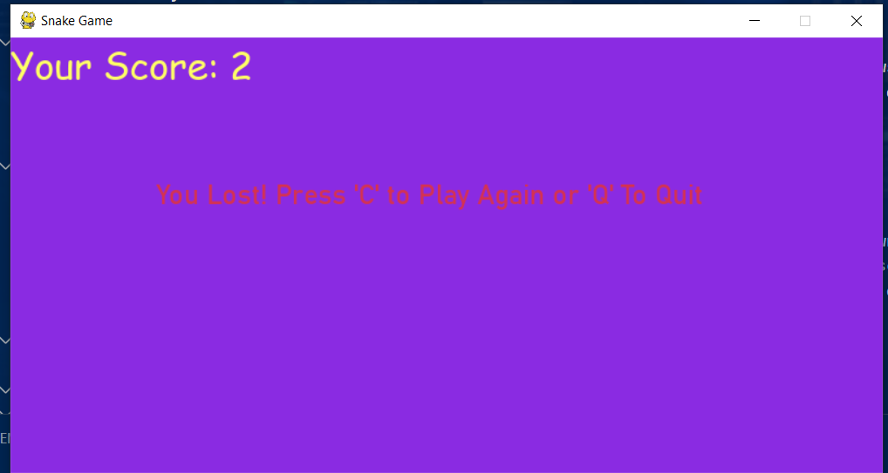
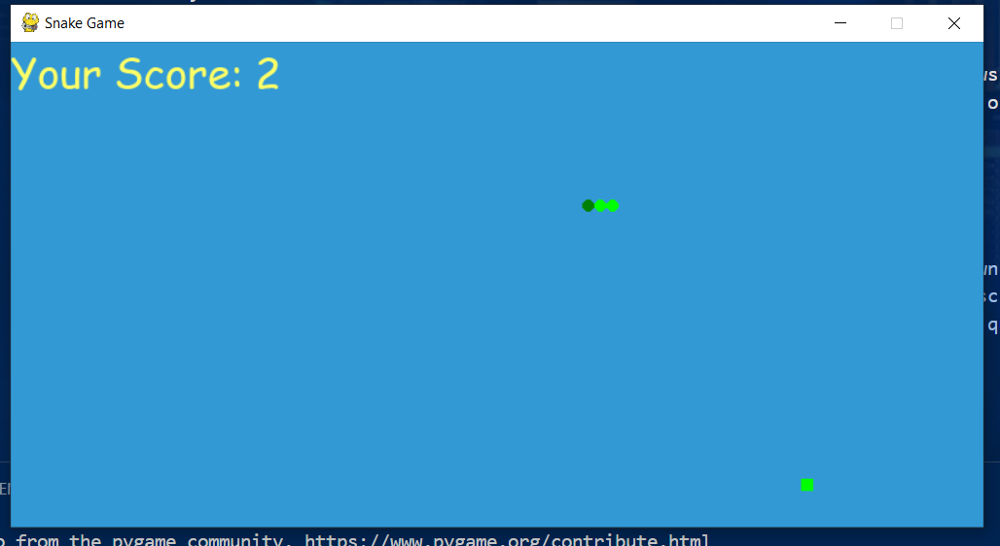

# 🐍 Snake Game in Python


## 📝 Submitted To:
**Instructor**: Dr. Prateek Raj Gautam  

---

## 🙋‍♂️ Submitted By:
**Name**: Anurag Kumar Singh  
**SAP ID**: 590018370  


## 📌 Project Title:
Snake Game in Python

## 📝 Description:
This is a classic Snake Game built using Python and the Pygame library. The game allows users to control a snake that grows longer as it eats food. The objective is to avoid running into walls or the snake's own body while trying to eat as much food as possible to increase your score.

### Key Features:
- **Snake Movement:** Control the snake using the arrow keys (Up, Down, Left, Right).
- **Increasing Snake Length:** Each time the snake eats food, it grows longer.
- **Collision Detection:** The game ends if the snake collides with the wall or its own body.
- **Score Display:** Your score (length of the snake) is displayed at the top of the screen.
- **Game Over Screen:** Displays your score and gives you the option to play again or quit.

## ⚙️ Installation:

1. **Clone the repository:**
   ```bash
   git clone "https://github.com/anurag815311/snake-game.git"

2. **Navigate to the project directory:**
   ```bash
   cd snake-game-python
   ```

3. **Install required libraries:**
   You need to have Python installed on your system. Install the required dependencies using pip:
   ```bash
   pip install pygame
   ```

##🚀 Usage:
1. **Run the game:**
   To start the game, run the Python script:
   ```bash
   python snake_game.py
   ```

2. **Controls:**
   - Use the **Arrow keys** to navigate the snake.
   - The game ends if the snake hits the wall or its own body.
   - When the game is over, press **'C'** to play again or **'Q'** to quit.

3. **Game Over:**
   The game will display a message and your score when you lose. You can choose to restart the game or quit.

## 🎮 Game Screenshots:



## 📚 Libraries Used:
- **Pygame:** For creating the game window, drawing graphics, and handling user input.
- **Python 3:** The programming language used for the game.

## ✨ Acknowledgments:
- **Pygame Documentation:** For providing excellent resources to help build this game.
- **Python Community:** For the amazing open-source libraries and tools available.

